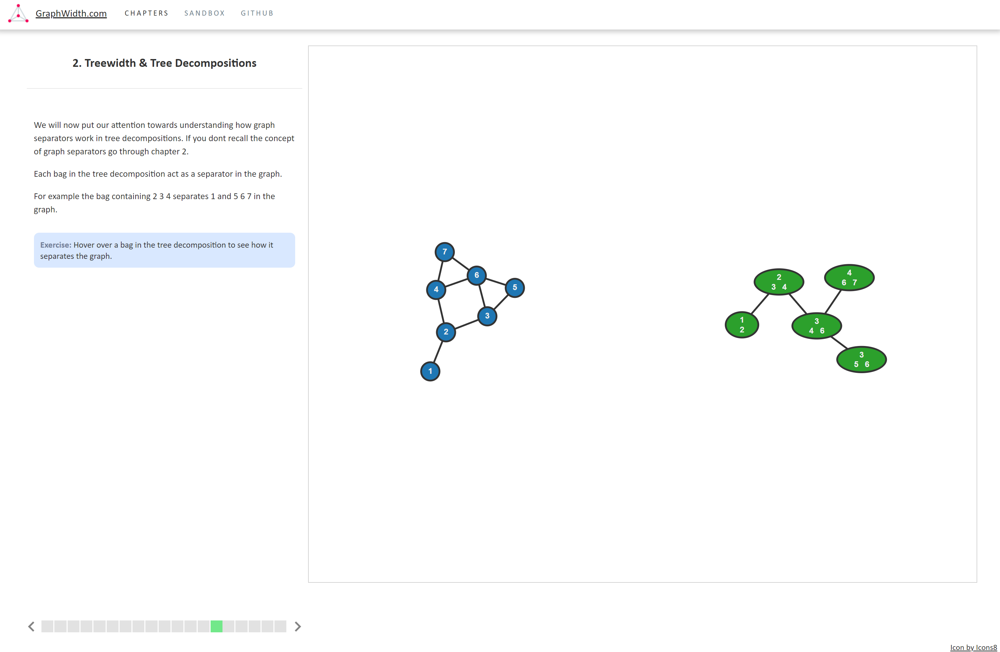

# GraphWidth.com



> In graph theory, the treewidth of an undirected graph is a number associated with the graph. Treewidth may be defined in several equivalent ways: from the size of the largest vertex set in a tree decomposition of the graph, from the size of the largest clique in a chordal completion of the graph - Wikipedia

[GraphWidth.com](http://www.graphwidth.com/) is a full-stack application aimed at anyone with an interest in graph width measures and their applications. The teaching is done through short & precise interactive lectures. Along with a 
'sandbox mode' for those who wish to explore the concepts without guidance.

## Chapters

- [x] Chapter 1 - Graph Separators
- [x] Chapter 2 - Treewidth & Tree Decompositions
- [x] Chapter 3 - Nice Tree Decompositions
- [x] Chapter 4 - Algorithms on Tree Decompositions
- [x] Sandbox Mode

## Custom Algorithm

We use a simple [switch statement](https://developer.mozilla.org/en-US/docs/Web/JavaScript/Reference/Statements/switch") to easily determine which node we are at.
- Each node has a <strong>table</strong> where you can store information about this node. Access this by using <code>node.table</code>.
- Each node has a <strong>childTable</strong>. Access this with <code>childTable</code>.
- To get an <strong>introduced vertex</strong> use <code>getIntroducedVertex()</code> on a node.
- The <strong>power set</strong> of a node is already calculated use <code>allSubsets</code> to access it.
- Access the respective graph object of a tree decomposition by using <code>graph</code>.
- To check if a vertex in a set is adjacent to any other vertex in the set use <code>graph.isVertexAdjacent(tree, set)</code> where tree is the tree rooted at this node and set is the set you want to check.
- Get the forgotten vertex of a node by using <code>getForgottenVertex(node).</code>

## Build your own chapter

You can build your own chapter and make use of [GraphWidth.com](http://www.graphwidth.com/)'s library to visualize your content.

To do so:
- First follow the installation to get the app installed and running
- Open `public/Chapters/content.txt`
- Enter your content and the functionality you want and rerun the application
- You can now see your custom content under chapter 5 'Misc'

### Commands
You can write content by using the **#p** command, you may include any math notation which is supported by [KaTeX](https://katex.org/).
```
#p This is a paragraph including math stuff \( X_i \leq  X^2 \)
```
Create a graph by using the **#create-graph** command followed by how you want each vertex to connect. I.e 1-2 connects a vertex called '1' with a vertex called '2'.
```
#create-graph 1-2 2-3
```
Compute the tree decomposition of the current graph by using the **#compute-tree-decomposition** command.
```
#compute-tree-decomposition
```
## Attributions
- [D3.js](https://d3js.org/)
- [KaTeX](https://katex.org/)
- [Icons8](https://icons8.com/)
- [Force In A Box](https://github.com/john-guerra/forceInABox)
- [Material Icons](https://material.io/resources/icons/?style=baseline)


## Requirements
- Java 8 or later
- Node 10 or later

## Install

Clone the repository:  
```bash
git clone https://github.com/FrederikJorgensen/graph-width-visualizer.git
```  
Change directory into the repository:  
```bash
cd graph-width-visualizer
```
Install the development tools:  
```bash
npm install
```    
Run the application:  
```bash
npm run dev
```

The app is then running at: 
[http://localhost:3000/index.html](http://localhost:3000/index.html)