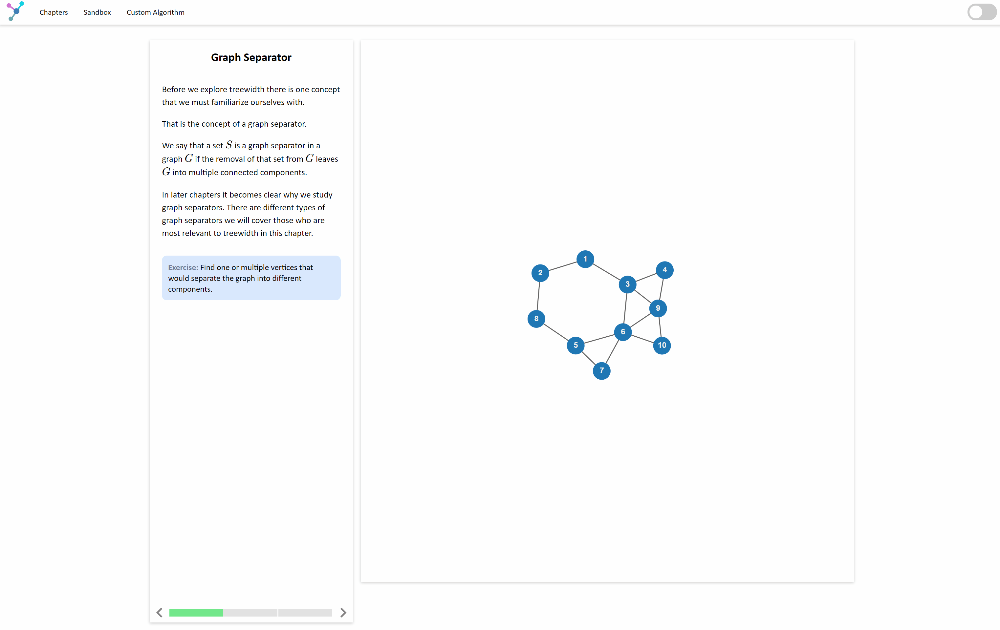

# GraphWidth.com

[GraphWidth.com](http://www.graphwidth.com/) is a full-stack application that teaches the concept of graph width measures through visualization.

## Chapters

- [x] Chapter 1 - Graph Separators
- [x] Chapter 2 - Treewidth & Tree Decompositions
- [x] Chapter 3 - Algorithms on Tree Decompositions
- [x] Sandbox Mode
- [x] Create a Custom Algorithm

## Built with

- [D3.js](https://d3js.org/)
- [KaTeX](https://katex.org/)
- [Force In A Box](https://github.com/john-guerra/forceInABox)
- [Material Icons](https://material.io/resources/icons/?style=baseline)
